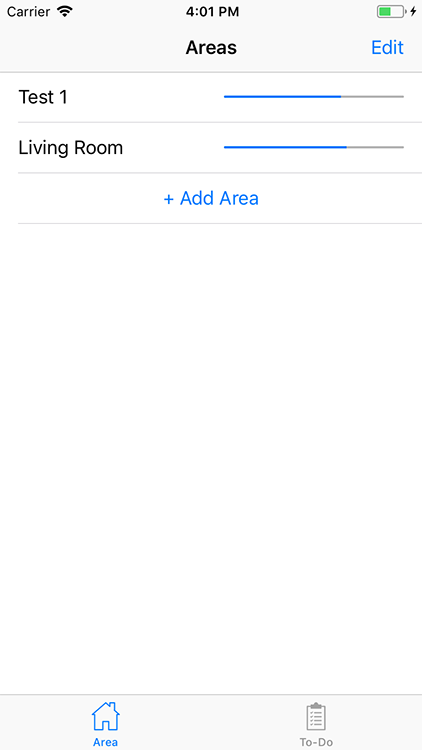
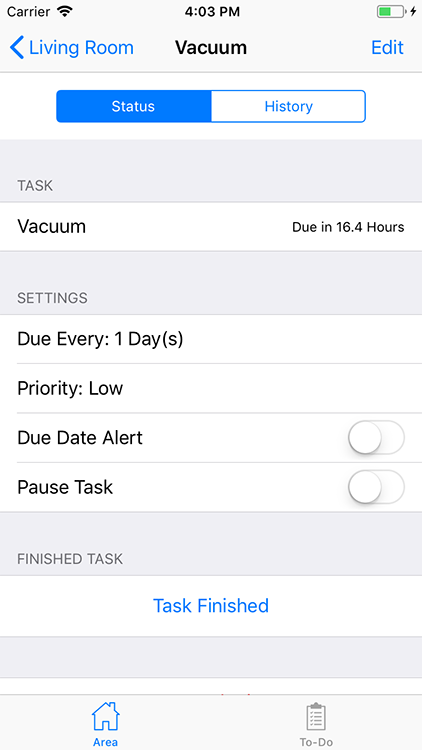

# Home Cleaning  
Sungmin Park  

An app to help manage cleaning routines in your household.

  

<a href="#Checkpoint-1">Checkpoint 1</a>  
<a href="#Checkpoint-2">Checkpoint 2</a>  
<a href="#Final">Final</a>  

## Proposed Features  
* Area View
  * Break down by rooms (living room, bedroom, bathroom, etc.)
  * Display area’s cleanliness (a meter, text, or something)
* Task View
  * Break down Task(clean sink, vacuum floor, etc.)
  * Add New Task
    * Task Name
    * Schedule routine (every 10 days)
    * Who should do the task
    * Quick Task set up (relaxed, standard, proactive cleaning)
  * Task displays when its due or if its overdue
  * Sort by feature
* Task Detail View
  * Allow notification
  * Toggle routine on / off
  * Task completed (resets timer)
    * Person that cleaned the area
  * List of previously cleaned dates
    * Who completed the task
* Task List View
  * Shows all task
  * Organized based on when task should be finished
* House Statistic
  * Which area is cleaned the most / least
  * What task is done the most / least
  * Who cleans the most / least
* App data shared between devices (allows multiple users to see same task)

## Checkpoint 1  

### App State  
Added App navigation structure using temperary area, and task code.  

  

### New Features  
* Basic App navigation
* Basic Area Class
* Basic Task Class

### Upcoming  
* Adding Areas
* Adding Tasks

<a href="#Home-Cleaning">To Top</a>  

## Checkpoint 2  

### App State  
Added the ability to add and remove areas and area's tasks.

Users are able to set up default task data.

    

### New Features  
* Able to create Area
* Able to create Task

### Upcoming  
* Ability to edit tasks
* Add functionality to Task Detail View

<a href="#Home-Cleaning">To Top</a>  

## Final    

### App State  
App is now able to save data. Users are able to edit task such as renaming, change time due and changing priority. Tasks can also be paused, submitted and reset.

To Do view shows all tasks for each area.

    

### New Features  
* App Icon
* Tab Bar Icons
* Task can be submitted, pause and reset
* When task is submited it will record the date to history tab
* Area progress bar updates based on tasks priortiy and remaining time
* App saves on background enter or new area added

<a href="#Home-Cleaning">To Top</a>  